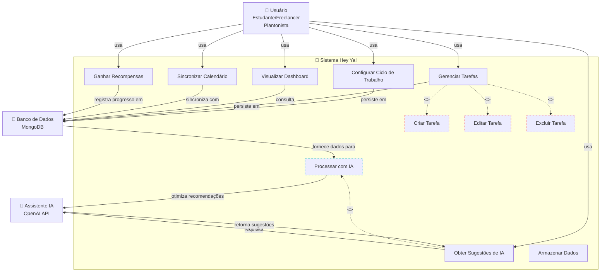

# 📊 Diagrama de Casos de Uso – Hey Ya!

## Visão Geral

Este diagrama apresenta todas as interações entre os atores (Usuário, Assistente de IA, Sistema) e os casos de uso do Hey Ya!, mapeando as funcionalidades essenciais da aplicação.

---

## Diagrama UML de Casos de Uso (Mermaid)



---

## 📋 Descrição Detalhada dos Casos de Uso

### **UC1 - Configurar Ciclo de Trabalho**

- **Ator:** Usuário
- **Descrição:** O usuário define sua escala de trabalho (12x36, 5x2, plantões esporádicos, flexível).
- **Resultado:** Sistema adapta sugestões e carga de tarefas conforme o ciclo configurado.
- **Relacionamento:** Fundamental para todas as operações subsequentes.

---

### **UC2 - Gerenciar Tarefas**

- **Ator:** Usuário
- **Descrição:** Conjunto de operações CRUD (Create, Read, Update, Delete) para tarefas.
- **Operações Incluídas:**
  - **UC3 - Criar Tarefa:** Adicionar nova tarefa com título, descrição, prazo e categoria.
  - **UC4 - Editar Tarefa:** Modificar propriedades da tarefa (prioridade, prazo, categoria).
  - **UC5 - Excluir Tarefa:** Remover tarefa do sistema.

---

### **UC6 - Visualizar Dashboard de Produtividade**

- **Ator:** Usuário
- **Descrição:** O usuário acessa visualizações gráficas de seu progresso.
- **Métricas Exibidas:**
  - Tempo gasto por área (Estudo, Trabalho, Saúde)
  - Tarefas completadas vs. pendentes
  - Nível de gamificação e pontos acumulados
  - Tendências de produtividade ao longo do tempo

---

### **UC7 - Sincronizar Calendário**

- **Ator:** Usuário
- **Descrição:** Importação de eventos de calendários externos (Google Calendar, Outlook, etc.).
- **Objetivo:** Prevenir conflitos de horários e automatizar a detecção de disponibilidade.

---

### **UC8 - Obter Sugestões de IA**

- **Ator:** Usuário → Assistente de IA
- **Descrição:** O sistema consulta a API OpenAI para receber recomendações personalizadas.
- **Inputs:** Contexto do usuário (carga de tarefas, nível de cansaço, escala de trabalho, histórico).
- **Outputs:** Sugestões de janelas ótimas para estudo/descanso, reorganização de prioridades.
- **Relacionamentos:**
  - **Extends UC10:** Processamento avançado com dados do MongoDB.

---

### **UC9 - Ganhar Recompensas (Gamificação)**

- **Ator:** Usuário
- **Descrição:** Atribuição de pontos, badges e níveis conforme o cumprimento de tarefas.
- **Regra de Negócio:** Usuários ganham recompensas maiores ao cumprir tarefas dentro do prazo durante períodos de alta carga.

---

### **UC10 - Processar com IA**

- **Ator:** Sistema → Assistente de IA
- **Descrição:** Orquestração interna que enriquece a IA com contexto do MongoDB antes de gerar sugestões.
- **Operações:**
  - Análise de padrões de comportamento do usuário
  - Detecção de sobrecarga (Regra RN01)
  - Verificação de restrições de plantão (Regra RN02)
  - Garantia de privacidade (Regra RN03)

---

### **UC11 - Armazenar Dados**

- **Ator:** Sistema → MongoDB
- **Descrição:** Persistência de todas as operações em documentos JSON flexíveis.
- **Vantagem:** Facilita ajustes rápidos no esquema e envio de contextos complexos à IA.

---

## 🔄 Fluxos de Interação Principais

### Fluxo 1: Ciclo Completo de Produtividade

```
Usuário → UC1 (Configura Ciclo)
        → UC2 (Cria Tarefas)
        → UC8 (Recebe Sugestões)
        → IA (Processa contexto via UC10)
        → UC6 (Visualiza Progress)
        → UC9 (Coleta Recompensas)
        → BD (Tudo persiste)
```

### Fluxo 2: Integração com Calendário

```
Usuário → UC7 (Sincroniza Calendário)
        → UC2 (Ajusta Tarefas)
        → UC6 (Dashboard atualiza)
        → BD (Novos dados armazenados)
```

---

## 🎯 Mapeamento para Requisitos Funcionais

| Caso de Uso        | RF Associado | Prioridade |
| ------------------ | ------------ | ---------- |
| UC1                | RF01         | 🔴 Alta    |
| UC2, UC3, UC4, UC5 | RF02         | 🔴 Alta    |
| UC8, UC10          | RF03         | 🔴 Alta    |
| UC6                | RF04         | 🟡 Média  |
| UC7                | RF05         | 🟡 Média  |
| UC9                | RF06         | 🟡 Média  |

---

## ✅ Validação e Próximos Passos

Cada caso de uso aqui documentado será implementado como:

1. **Classes Java:** Handlers e Controllers que executam a lógica
2. **Testes Unitários:** Validação de cada fluxo crítico
3. **Testes de Integração:** Verificação da comunicação entre atores (Usuário, IA, BD)
4. **UI Android:** Telas que correspondem aos casos de uso do usuário

---
